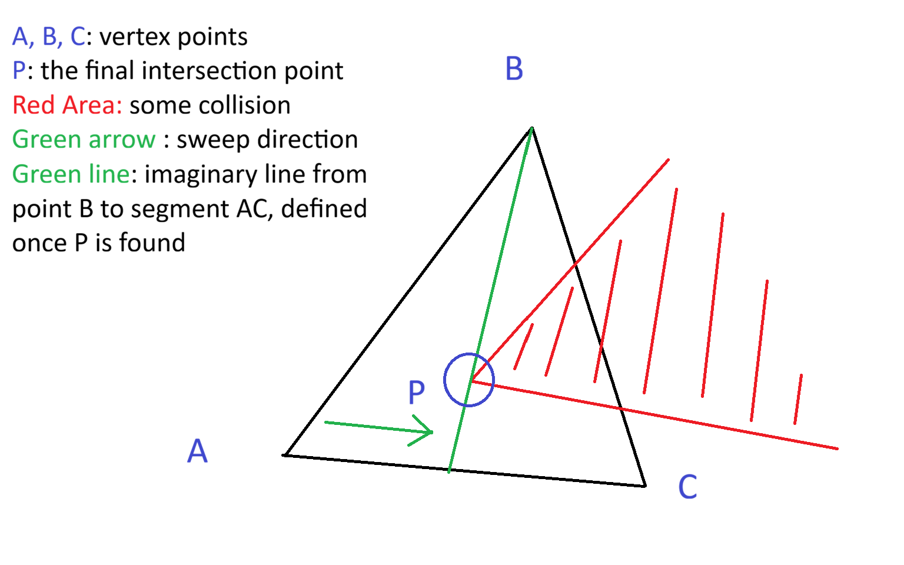
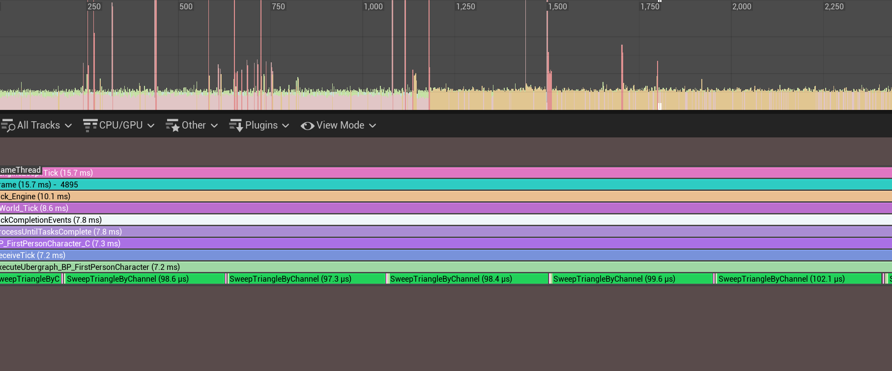
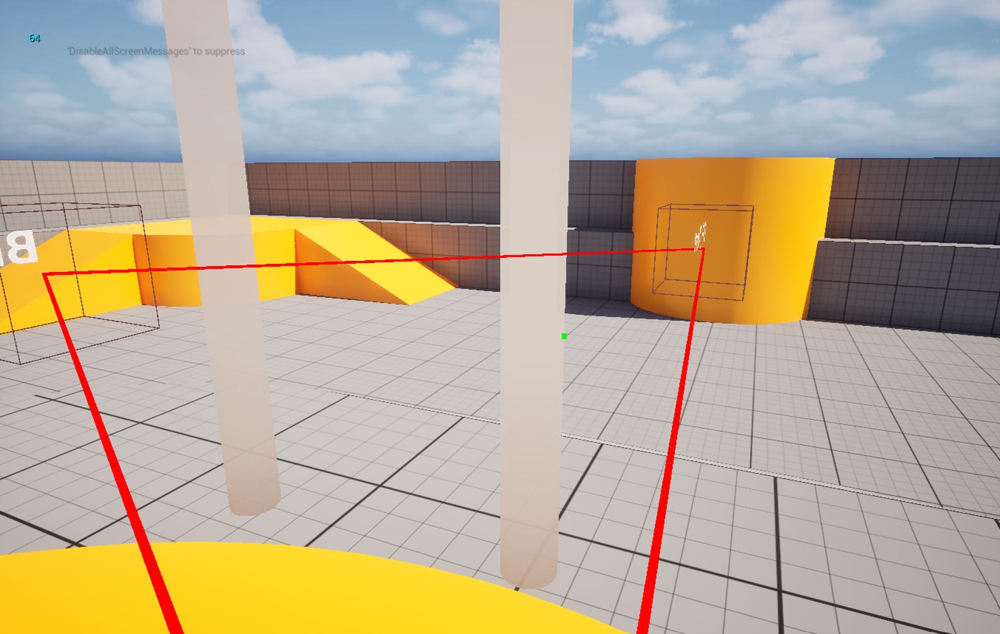

# Triangle Sweep Plugin

A high-performance Unreal Engine 5 plugin for executing geometric sweep queries using a 2D triangle. 
It provides Blueprint-exposed functions that mirror the native `LineTrace` and `BoxTrace` nodes, but tailored for custom triangular geometry.

## Features

- **Blueprint API**: Six ready-to-use nodes for all your collision needs:
  - `Sweep Triangle By Channel`
  - `Sweep Triangle By Profile`
  - `Sweep Triangle For Objects`
  - `Multi Sweep Triangle By Channel`
  - `Multi Sweep Triangle By Profile`
  - `Multi Sweep Triangle For Objects`
- **Fully Populated FHitResult**: Returns complete physical hit data including `ImpactPoint`, `Normal`, `Time`, and `Distance`.
- **Zero Heap Allocations (Single Sweep)**: Core loops are heavily optimized, utilizing `TInlineAllocator` to keep data exclusively on the stack.
- **Fast Rejection Methods**: Implements early-out sphere checks to minimize the amount of math operations processed per overlapping body.
- **Advanced Display Integration**: Trace color settings, draw time, and the `bIgnoreSelf` flag are integrated into the standard Kismet Blueprint UX.
- **Complex Collision Support**: Support for `bTraceComplex` to calculate per-poly collision if needed.

## Performance

This plugin is designed to run in the narrow-phase within the game thread seamlessly. According to Unreal Insights profiling on an Intel Core Ultra 7 255H, the typical Blueprint node execution ranges from **90μs to 300μs** (microseconds), with an average typical case of **100-120μs**. 
This means you can comfortably run up to **50 triangle sweeps per tick** on this hardware without breaking the 60 FPS (16.67ms) frame budget.

*(Note: Any execution spikes visible in the profiler screenshot below are completely unrelated to the Triangle Sweep plugin's operations).*

## Installation

1. Create a `Plugins` folder in your project's root directory if it doesn't already exist.
2. Clone or download this repository into the `Plugins/TriangleSweep` directory.
3. Right-click your project's `.uproject` file and select **Generate Visual Studio project files**.
4. Open the generated solution and compile your project. The plugin will be built automatically.

## Usage

Once installed, simply right-click in any Blueprint and search for `Sweep Triangle`. The nodes operate identically to standard Unreal Engine trace functions. 
Vectors A, B, and C define the world-space positions of the triangle's vertices.

